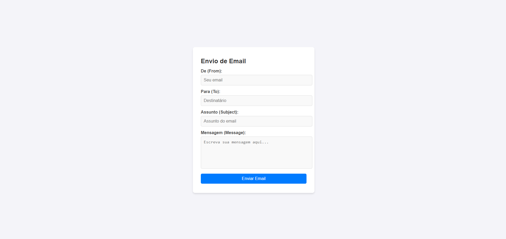

# testes_phpmailer-composer



# Projeto de Envio de E-mail com PHP e PHPMailer

Este é um pequeno projeto de teste e estudo que demonstra como enviar um e-mail de uma conta para outra usando **PHP**, **PHPMailer** e **Composer**. O objetivo deste projeto é aprender sobre o uso de bibliotecas PHP e como configurar o envio de e-mails de forma simples.

## Tecnologias Utilizadas

- **PHP**: Linguagem de programação para desenvolver a aplicação.
- **PHPMailer**: Biblioteca para envio de e-mails de forma mais fácil e segura.
- **Composer**: Gerenciador de dependências para PHP, utilizado para instalar o PHPMailer.
- **XAMPP**: Ambiente de desenvolvimento local que inclui Apache, MySQL e PHP, utilizado para executar o projeto.

## Pré-requisitos

Antes de executar o projeto, verifique se você possui o seguinte:

- **PHP** (versão 7.3 ou superior)
- **Composer** (para gerenciar as dependências)
- **XAMPP**: Certifique-se de que o XAMPP esteja instalado para rodar o servidor Apache e o PHP localmente.

## Como Instalar e Configurar

### 1. Clonar o Repositório

Primeiro, clone este repositório em seu computador:

```bash
git clone https://github.com/FelipeSDS23/testes_phpmailer-composer.git
cd testes_phpmailer-composer
```

2. Instalar as Dependências
Dentro do diretório do projeto, execute o Composer para instalar as dependências (no caso, o PHPMailer):

```bash
composer install
```

Isso irá baixar o PHPMailer e todas as suas dependências.

3. Crie e configure um arquivo .env na raiz do projeto
Altere os dados do servidor SMTP conforme exemplificado no arquivo ".env.example.

Configuração básica e acesso:

- Atenção: Altere os dados do servidor SMTP para os do seu serviço de e-mail.
- Caso utilize o XAMPP mova a pasta com os arquivos para o diretório htdocs do seu servidor (geralmente localizado em: C:\xampp\htdocs)
- Acesse em: http://localhost/testes_phpmailer-composer/src/index.php

